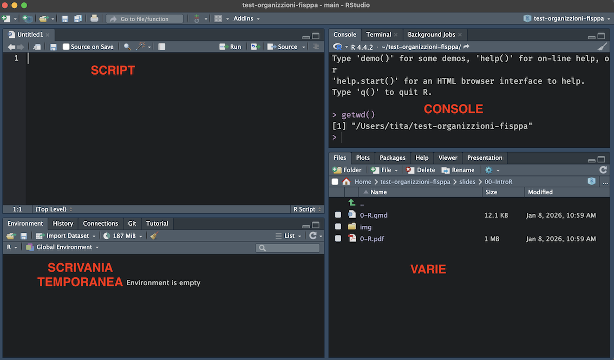
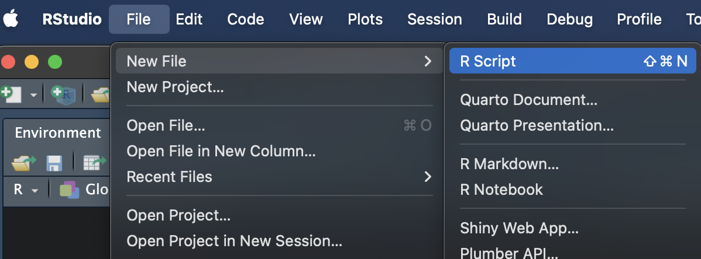
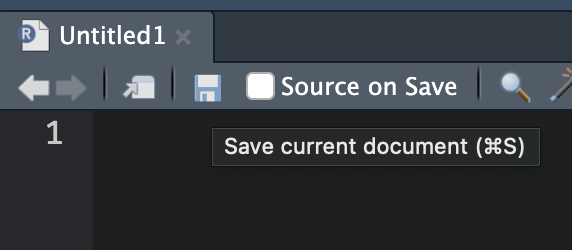
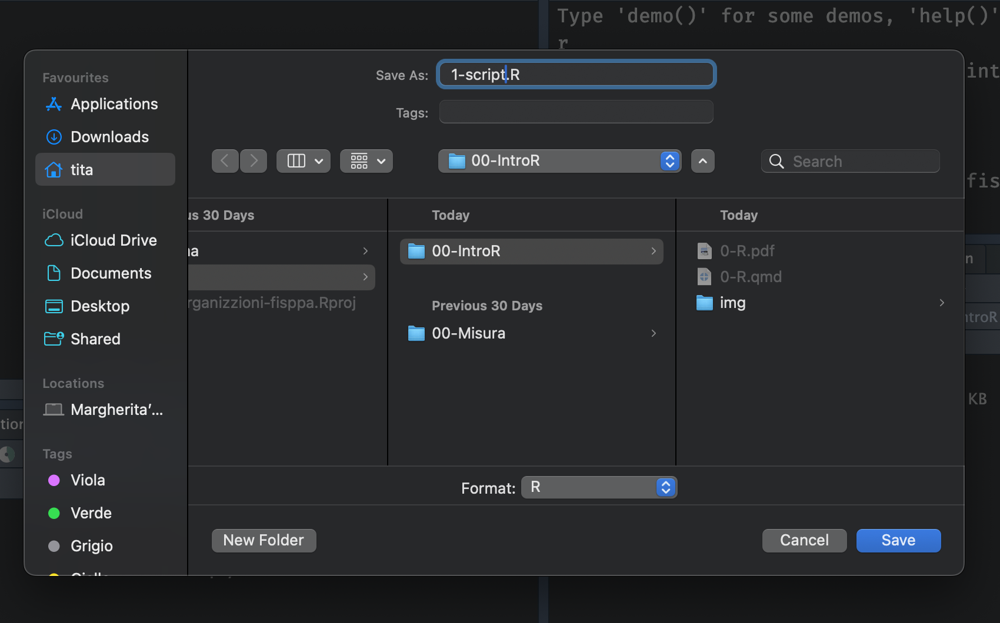
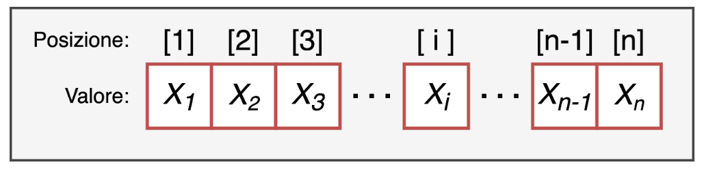

```{r, echo=FALSE}
set.seed(123)  # fissa il generatore di numeri casuali: tutti ottengono gli stessi risultati
```

# Primi Passi

## Ambiente di lavoro

RStudio è diviso in **4 pannelli principali**:


{fig-align="left" width="800"}


**1. Script.** 
Il file di testo dove scrivi e salvi il codice. Puoi eseguire una riga alla volta (`Ctrl + Invio` / `Cmd + Enter`) oppure tutto lo script cliccando `Source`. I commenti si aggiungono con `#`.

**2. Console.** 
Qui R esegue il codice e mostra i risultati. Puoi scrivere comandi direttamente nella console per prove rapide, ma non vengono salvati. Contiene anche le tab *Terminal* e *Background Jobs*.

**3. Environment / Scrivania temporanea.** 
Mostra tutti gli **oggetti** creati durante la sessione corrente. Contiene anche le tab *History*, *Connections*, *Git* e *Tutorial*.

**4. Varie.** 
Pannello multifunzione con diverse tab:

- **Files** — esplora i file e le cartelle del working directory
- **Plots** — mostra i grafici prodotti dal codice
- **Packages** — gestisce i pacchetti installati
- **Help** — visualizza la documentazione delle funzioni (equivalente di `?nomefunzione`)
- **Viewer** — anteprima di documenti HTML (es. file Quarto renderizzati)
- **Presentation** — anteprima di presentazioni Quarto


::: callout-note
## Console

I comandi nella console vengono eseguiti ma **non salvati**.

Per eseguire il comando → `Invio`

L\'output è immediato e appare nella console.
:::

::: callout-note
## Script

È possibile salvare gli script con tutti i comandi.

Per eseguire il comando → `Ctrl + Invio` (`Cmd + Enter` su Mac)

L\'output è restituito nella console.
:::

## Working Directory

### Dove sta lavorando R?

La **working directory** è la cartella in cui R cerca i file da caricare e salva gli output. Per sapere dove si trova, si usa `getwd()`:

```{r}
# getwd() = "get working directory"
# restituisce il percorso della cartella in cui R sta lavorando
getwd()
```

Per cambiare working directory si usa `setwd()`:

```{r, eval=FALSE}
# setwd() = "set working directory"
# incolla qui il percorso della tua cartella di lavoro

setwd("/Utente/NomeUtente/Desktop/NomeCartella")            # Mac
setwd("C:/Utente/NomeUtente/OneDrive/Desktop/NomeCartella") # Windows con OneDrive
setwd("C:/Utente/NomeUtente/Desktop/NomeCartella")          # Windows
```

::: callout-tip
In RStudio puoi anche usare **Session → Set Working Directory → Choose Directory** per impostare la cartella senza scrivere il percorso a mano.
:::

Vi consiglio di creare una cartella sul vostro Desktop dove salverete tutto il materiale del corso.

---

### Creare uno script

{fig-align="center" width="500"}

### Salvare uno script

::::: columns
::: {.column width="30%"}
{fig-align="center" width="400"}
:::
::: {.column width="70%"}
{fig-align="center" width="500"}
:::
:::::

Salviamo lo script dentro la cartella d'interesse!

---

### Pulire l\'ambiente di lavoro

Prima di iniziare a lavorare, è buona abitudine **pulire l\'ambiente** di R, cioè rimuovere tutti gli oggetti creati in sessioni precedenti:

```{r}
rm(list = ls())  # rm = "remove", ls() = lista di tutti gli oggetti in memoria
                 # insieme: elimina tutti gli oggetti dall'ambiente corrente
```

::: callout-warning
Questo comando elimina **tutti** gli oggetti presenti nell\'ambiente. Assicurati di aver salvato tutto ciò che ti serve prima di eseguirlo.
:::

---


## Pacchetti

R di base è già molto potente, ma la sua vera forza sta nei **pacchetti**: collezioni di funzioni aggiuntive sviluppate dalla comunità.

Per usare un pacchetto bisogna fare due cose:

1. **Installarlo** — si fa **una volta sola** per computer:

```{r, eval=FALSE}
install.packages("readr")   # scarica e installa il pacchetto
install.packages("writexl") # basta farlo una volta, poi rimane installato
```

2. **Caricarlo** — si fa **ogni volta** che si apre una nuova sessione di R:

```{r, eval=FALSE}
library(readr)   # rende disponibili le funzioni del pacchetto
library(writexl)
```


# Oggetti

Gli oggetti si creano con l\'operatore `=` oppure `<-`, seguendo la sintassi `nomeOggetto <- contenuto`:

```{r}
nome1 = "contenuto"   # con =
nome2 <- "contenuto"  # con <- (stessa cosa)
```

I tipi principali di oggetti in R sono:

```{r}
ch   = "carattere"  # character: testo, sempre tra virgolette
num  = 4            # numeric: numero intero
dec  = 1.5          # numeric: numero decimale (usa il punto, non la virgola!)
logi = FALSE        # logical: solo TRUE o FALSE (ricorda: FALSE = 0, TRUE = 1)
```

Per controllare il tipo di un oggetto si usa `class()`:

```{r}
class(ch)   # "character"
class(num)  # "numeric"
class(logi) # "logical"
```


## Vettori

I vettori si creano con la funzione `c()`. Sono strutture **monodimensionali**, caratterizzate solo dalla loro lunghezza, ottenibile con `length()`.

{fig-align="center"}

```{r}
vet = c(2, 3, 4, 5)  # creo un vettore di 4 numeri
length(vet)           # restituisce 4
```

Un vettore deve contenere elementi **dello stesso tipo**. Se si mescolano tipi diversi, R converte tutto in `character` (coercizione):

```{r}
vet_ok    = c(2, 3, 4, NA, 5)   # NA è un valore mancante, non una stringa: rimane numeric
class(vet_ok)

vet_wrong = c(2, 3, 4, "NA", 5) # "NA" è una stringa: R converte tutto il vettore in character
class(vet_wrong)
```

### Indicizzazione

Per estrarre elementi da un vettore si usano le parentesi quadre `[]`:

```{r}
vet            # vettore completo: 2 3 4 5
vet[1]         # primo elemento: 2
vet[c(1, 4)]   # primo e quarto elemento: 2 5
```

È anche possibile usare l\'**indicizzazione logica** per estrarre solo gli elementi che soddisfano una condizione:

```{r}
vet > 2 & vet < 7          # restituisce TRUE/FALSE per ogni elemento
vet[vet > 2 & vet < 7]     # estraggo solo gli elementi per cui la condizione è TRUE

# alternativa: salvo prima le posizioni di interesse...
posizioni = vet > 2 & vet < 7
vet[posizioni]              # ...e le uso per estrarre
```


## Fattori

I fattori sono vettori che sembrano di tipo `character`, ma sono caratterizzati anche da **livelli** (categorie). Si creano con `factor()`:

```{r}
fact1 = factor(
  x      = c("basso", "medio", "alto", "basso", "medio", "alto"),
  levels = c("basso", "medio", "alto")  # definisce l'ordine dei livelli
  # labels = c("B", "M", "A")           # opzionale: rinomina le etichette
)
```

È importante specificare `levels` quando l\'**ordine** dei livelli è rilevante (es. variabili ordinali).

Se invece non si specifica l'argomento `levels` o si crea un vettore di tipo `character`, e poi lo si trasforma a fattore attraverso la funzione  `as.factor()`, R assegna i livelli in **ordine alfabetico**:

```{r}
# vettore di tipo `character`
vettore_ch = c("basso", "medio", "alto", "basso", "medio", "alto")
# lo trasformo a fattore
fact2 = as.factor(vettore_ch)  # livelli: alto, basso, medio (ordine alfabetico)

fact1  # livelli: basso, medio, alto  (ordine specificato)
fact2  # livelli: alto, basso, medio  (ordine alfabetico)
```

---

I livelli rimangono come **metadati** anche quando non ci sono più osservazioni per quel livello:

```{r}
fact1

# rimuovo tutte le osservazioni con livello "basso"
fact3 = fact1[fact1 != "basso"]
fact3  # il livello "basso" è ancora presente tra i metadati!
```

Per rimuovere i livelli senza osservazioni si usa `droplevels()`:

```{r}
fact3 = droplevels(fact3)  # elimina i livelli non più utilizzati
fact3                       # ora i livelli sono solo: medio, alto
```

::: callout-note
La funzione `rep()` permette di ripetere stringhe o numeri senza scriverli uno ad uno:

```{r}
# manualmente (noioso e soggetto a errori):
c("basso", "medio", "alto", "basso", "medio", "alto", "basso", "medio", "alto")

# con rep(): molto più comodo
rep(c("basso", "medio", "alto"), times = 3)  # ripete il vettore 3 volte
```
:::

## Matrici

Le matrici sono strutture **bidimensionali** — hanno righe e colonne — e si creano con `matrix()`. La funzione `dim()` restituisce entrambe le dimensioni (righe, colonne):

```{r}
# data: valori da inserire (riempie per colonna per default)
# nrow: numero di righe, ncol: numero di colonne
my_mat = matrix(data = 1:10, nrow = 2, ncol = 5)
my_mat
dim(my_mat)  # restituisce c(2, 5): 2 righe, 5 colonne
```

Come i vettori, le matrici possono contenere **una sola tipologia** di dati.

### Indicizzazione

Per selezionare elementi di una matrice si usano due indici separati da virgola: `matrice[riga, colonna]`.

```{r}
my_mat[1, 1]  # elemento in riga 1, colonna 1
my_mat[1, ]   # intera prima riga (colonna lasciata vuota = tutte le colonne)
my_mat[, 1]   # intera prima colonna (riga lasciata vuota = tutte le righe)
```


## Concatenare Vettori e Matrici

I vettori si possono concatenare tra loro con `c()`:

```{r}
my_vect1  = c(1:4)                # vettore 1: 1 2 3 4
my_vect2  = c(5:10)               # vettore 2: 5 6 7 8 9 10
my_vect12 = c(my_vect1, my_vect2) # risultato: 1 2 3 4 5 6 7 8 9 10
my_vect12
```

Le matrici si uniscono con `cbind()` (per colonna) o `rbind()` (per riga):

```{r}
my_mat1 = matrix(data = 1:4, nrow = 2, ncol = 2)
my_mat2 = matrix(data = 5:8, nrow = 2, ncol = 2)

cbind(my_mat1, my_mat2)  # affianca le due matrici → risultato: 2 righe, 4 colonne
rbind(my_mat1, my_mat2)  # impila le due matrici  → risultato: 4 righe, 2 colonne
```


## Dataframe

Il dataframe è la struttura più usata in R per analizzare dati. Puoi pensarlo come un foglio Excel:

- ogni **colonna** è un vettore con un nome
- tutte le colonne hanno lo stesso numero di righe (**struttura rettangolare**)
- colonne diverse possono contenere tipi diversi di dati

Si crea con `data.frame()`:

```{r}
my_df = data.frame(
  numeri  = 1:4,                           # colonna numerica
  lettere = letters[1:4],                  # colonna character (letters = a, b, c, ...)
  normale = rnorm(n = 4, mean = 0, sd = 1) # 4 valori casuali da distribuzione normale
)
my_df
```

Per ottenere informazioni sulla struttura del dataframe:

```{r}
names(my_df)  # nomi delle colonne
dim(my_df)    # dimensioni: c(righe, colonne)
nrow(my_df)   # numero di righe
ncol(my_df)   # numero di colonne
```

La funzione più utile è `str()`, che fornisce una panoramica rapida: dimensioni, tipi di variabili e primi valori:

```{r}
str(my_df)  # str = "structure": mostra tipo e contenuto di ogni colonna
```


### Indicizzazione

Come per le matrici, si usano le parentesi quadre `[]`:

```{r}
my_df[1]     # prima colonna → restituisce un data.frame con una colonna
my_df[1, 1]  # elemento in riga 1, colonna 1 → restituisce un singolo valore
```

### Indicizzazione con `$`

L\'operatore `$` è il modo più diretto per accedere a una colonna per nome:

```{r}
my_df$numeri     # estraggo l'intera colonna "numeri" come vettore
my_df$numeri[1]  # primo elemento della colonna "numeri"
```

### Indicizzazione Logica

Molto spesso si ha bisogno di selezionare solo alcune righe del dataset in base a una condizione:

```{r}
# righe in cui "numeri" è maggiore di 2
my_df[my_df$numeri > 2, ]

# righe in cui "numeri" è compreso tra 2 e 4 (esclusi)
my_df[my_df$numeri > 2 & my_df$numeri < 4, ]

# righe in cui "numeri" == 2, ma solo la seconda colonna (per indice)
my_df[my_df$numeri == 2, 2]

# righe in cui "numeri" == 2, ma solo la colonna "lettere" (per nome)
my_df[my_df$numeri == 2, "lettere"]
```

### Indicizzazione con `subset()`

La funzione `subset()` è un\'alternativa più leggibile per filtrare righe e selezionare colonne:

```{r}
# ricreo il dataframe con più osservazioni per gli esempi
my_df = data.frame(
  numeri  = rep(1:3, each = 3),         # 1 1 1 2 2 2 3 3 3
  lettere = rep(letters[1:3], 3),       # a b c a b c a b c
  normale = rnorm(n = 9, mean = 0, sd = 1)
)
head(my_df, n = 5)  # head() mostra le prime n righe del dataframe
```

`subset()` con l\'argomento `subset=` filtra le righe:

```{r}
# seleziono le righe in cui lettere == "a" E numeri > 2
subset(my_df, subset = lettere == "a" & numeri > 2)
```

È equivalente a:

```{r}
# stessa selezione con indicizzazione logica classica
my_df[my_df$lettere == "a" & my_df$numeri > 2, ]
```

Con l\'argomento `select=` si scelgono le colonne da mantenere:

```{r}
# seleziono solo le colonne "lettere" e "numeri"
subset(my_df, select = c(lettere, numeri))
```

I due argomenti si possono combinare:

```{r}
# filtro le righe E seleziono le colonne contemporaneamente
subset(my_df,
       subset = lettere == "a" & numeri > 2,  # condizione sulle righe
       select = c(lettere, numeri))            # colonne da tenere
```

### Creare e modificare variabili con `$`

L\'operatore `$` si usa anche per creare nuove colonne o modificare quelle esistenti:

```{r}
# creo una nuova colonna come somma di "numeri" e "normale"
my_df$somma = my_df$numeri + my_df$normale

# modifico la colonna "numeri" aggiungendo 1 a ogni valore
my_df$numeri = my_df$numeri + 1

# creo una colonna che combina "numeri" e "lettere" in una stringa (es. "2_a")
my_df$both = paste(my_df$numeri, my_df$lettere, sep = "_")  # ?paste per la documentazione

str(my_df)
```


### Combinare Dataframe

Per unire due dataframe con le stesse colonne si usa `rbind()`. Le colonne devono avere gli **stessi nomi** e lo **stesso numero**:

```{r, error=TRUE}
my_df2 = data.frame(
  numeri  = 1:9,                  
  lettere = letters[1:9],
  normale = rnorm(9, mean = 0, sd = 1),
  somma   = my_df$somma,
  both    = paste(1:9, letters[1:9], sep = "_")
)

rbind(my_df, my_df2)

my_df3 = rbind(my_df, my_df2) # creo il dateset completo

str(my_df3) # ora ho tutte le osservazioni
```


### Unire dataframe con chiave comune: `merge()`

Quando si vogliono combinare due dataframe tramite una variabile in comune (es. l\'ID soggetto), si usa `merge()`:

```{r}
# dataframe con i tempi di reazione (800 osservazioni, 2 soggetti x 2 condizioni)
df_rt = data.frame(
  subj = factor(rep(c("caio", "tizio"), each = 400)),
  cond = factor(rep(c("easy", "hard"), each = 200, times = 2)),
  rt   = c(rlnorm(n = 400, meanlog = -1, sdlog = .25),  # RT condizione easy
           rlnorm(n = 400, meanlog = -.7, sdlog = .3))   # RT condizione hard
)

# dataframe con l'età dei soggetti (una riga per soggetto)
df_age = data.frame(
  subj = factor(c("caio", "tizio")),
  age  = c(20, 30)
)

# merge() unisce i due dataframe usando "subj" come chiave comune
# ogni riga di df_rt viene arricchita con l'età del soggetto corrispondente
df_all = merge(x = df_rt, y = df_age, by = "subj")

str(df_all) # struttura del dataframe

head(df_all, n = 5) # prime n osservazioni
tail(df_all, n = 5) # ultime n osservazioni
```


# Esportazione e Importazione Dati

R supporta molti formati. I più comuni sono `.csv`, `.xlsx` e `.rda`.

| Formato | Funzione esportazione | Funzione importazione | Pacchetto     | Quando usarlo                              |
|---------|----------------------|-----------------------|---------------|--------------------------------------------|
| `.csv`  | `write_csv()`        | `read_csv()`          | `readr`       | Condivisione con altri software (Excel, SPSS, ...) |
| `.rda`  | `save()`             | `load()`              | base R        | Salvare oggetti R (anche più di uno)       |
| `.xlsx` | `write_xlsx()`       | `read_xlsx()`         | `writexl` / `readxl` | Condivisione con utenti Excel        |

**Esportazione:**

```{r, message=FALSE, warning=FALSE}
library(readr)    # contiene write_csv() e read_csv()
library(writexl)  # contiene write_xlsx()

# salva df_rt come file CSV nella cartella "data/"
# row.names = FALSE (default in write_csv): non aggiunge una colonna con i numeri di riga
write_csv(df_rt, file = "data/df_rt.csv")

# salva df_rt in formato nativo R (.rda)
# vantaggio: mantiene tipi, fattori, attributi esattamente come sono in R
# svantaggio: leggibile solo da R
save(df_rt, file = "data/df_rt.rda")

# salva df_age come file Excel (.xlsx)
write_xlsx(df_age, path = "data/df_age.xlsx")
```

**Importazione:**

```{r, eval=FALSE}
# legge un CSV e lo salva come oggetto → occorre sempre assegnarlo a un nome!
df_rt_csv = read_csv("data/df_rt.csv")
# nota: read_csv() (readr) restituisce un tibble, read.csv() (base R) un data.frame classico

# load() non restituisce un valore: ripristina direttamente l'oggetto
# con il nome che aveva quando è stato salvato (in questo caso: df_rt)
load("data/df_rt.rda")

# legge un file Excel
library(readxl)   # pacchetto separato da writexl: serve solo per leggere
df_age_xlsx = read_xlsx("data/df_age.xlsx")
```

::: callout-warning
Con `load()` non puoi scegliere il nome dell\'oggetto: viene ripristinato con il nome originale. Se nell\'ambiente esiste già un oggetto con lo stesso nome, **verrà sovrascritto senza avviso**.
:::