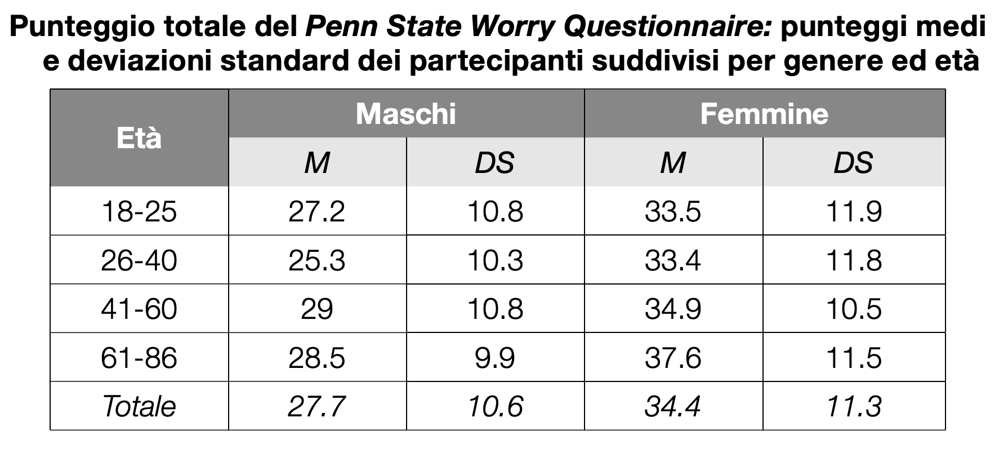

```{r}
#| include: false
#| message: false
#| warning: false

set.seed(15051995)

pkg <- c("ggplot2","patchwork","distributional","ggdist","tidyverse")
sapply(pkg, require, character.only = T)

gen_norm <- function(mu, sd){
  x = rnorm(1e6,mu,sd)
  return(data.frame(x=x))
}

my_cols <- c("deeppink4", "deepskyblue4", "#F8A31B", "forestgreen", "#000000")

theme_clean <- function(base_size = 14) {
  list(
    theme_classic(base_size = base_size),
    theme(
      axis.line  = element_line(colour = "black", linewidth = 1),
      axis.ticks = element_line(colour = "black", linewidth = 1),
      axis.ticks.length = grid::unit(10, "pt"),
      axis.text = element_text(colour = "black"),
      axis.text.y = element_text(angle = 90, vjust = 0.5, hjust = 0.5),
      axis.text.x = element_text(vjust = 0.5, hjust = 0.5),
      legend.title = element_text(size = base_size),
      legend.text  = element_text(size = base_size),
      legend.key.size = grid::unit(1.2, "lines")
    ),
    guides(
      x = guide_axis(cap = "both"),
      y = guide_axis(cap = "both")
    )
  )
}


burnout = read.csv("data/burnout.csv")

```

------------------------------------------------------------------------

#### Come si valida un test?

-   **I**: Valutazione preliminare
-   **II**: Studio esplorativo
-   **III**: Studio confermativo
-   **IV**: Standardizzazione e taratura

$\rightarrow$ somministrare lo strumento a un campione rappresentativo,
definendo norme e punteggi di riferimento.

## La distribuzione normale

Si presuppone che la caratteristica misurata abbia una **distribuzione
nota** nella popolazione. Di solito si assume una **distribuzione
normale**:

```{r, echo=FALSE, warning=FALSE, message=FALSE, fig.height=2, fig.width=6}
dat = data.frame(x = rnorm(1e7))
dat|>ggplot(aes(x = x))+geom_density(fill = my_cols[4])+
  scale_x_continuous(breaks = seq(-4,4, 1))+theme_clean()
```

La maggior parte degli individui ha quantità *intermedie* della
caratteristica, quindi pochi individui si collocano agli estremi.

------------------------------------------------------------------------

La distribuzione normale è definita da due parametri $\mu$ (la media) e
$\sigma^2$ (varianza):

<br/>

```{r}
#| echo: false
#| fig-width: 10
#| fig-height: 4
#| fig-align: center

dat = data.frame(x = rbind(gen_norm(0,1),gen_norm(0,2),gen_norm(2,1)),
                 parameters = rep(c("Normale(0, 1)",
                                    "Normale(0, 2)",
                                    "Normale(2, 1)"), each = nrow(gen_norm(0,1))))

ggplot(subset(dat,parameters == "Normale(0, 1)"), aes(x=x, fill = parameters))+
  geom_density(alpha = 0.8)+
  scale_fill_manual(values = my_cols)+
  xlab("")+xlim(-8,8)+
  theme_clean(base_size = 24)+
  theme(legend.position = "right",
        legend.title=element_blank())
```

------------------------------------------------------------------------

La distribuzione normale è definita da due parametri $\mu$ (la media) e
$\sigma^2$ (varianza):

<br/>

```{r}
#| echo: false
#| fig-width: 10
#| fig-height: 4
#| fig-align: center
ggplot(subset(dat, parameters != "Normale(2, 1)"), aes(x = x, fill = parameters)) +
  geom_density(alpha = 0.8) +
  scale_fill_manual(values = my_cols) +
  xlab("") + xlim(-8, 8) +
  theme_clean(base_size = 24) +
  theme(legend.position = "right", legend.title = element_blank())
```

------------------------------------------------------------------------

La distribuzione normale è definita da due parametri $\mu$ (la media) e
$\sigma^2$ (varianza):

<br/>

```{r}
#| echo: false
#| fig-width: 10
#| fig-height: 4
#| fig-align: center

ggplot(dat, aes(x=x, fill = parameters))+
  geom_density(alpha = 0.8)+
  scale_fill_manual(values = my_cols)+
  xlab("")+xlim(-8,8)+
  ylim(0,0.4)+
  theme_clean(base_size = 24)+
  theme(legend.position = "right",
        legend.title=element_blank())
```

## Standardizzazione e taratura

1.  Raccogliere i punteggi grezzi sul campione normativo
2.  Stimare i parametri della distribuzione ($\mu$, $\sigma$)
3.  Trasformare i punteggi in scale standardizzate
4.  Produrre le **tavole di conversione** grezzi → standardizzati

**Scale comuni:** percentili, **punti Z**, ...

------------------------------------------------------------------------

```{r}
#| echo: false
#| fig-width: 18
#| fig-height: 8
#| fig-align: center

dat = data.frame(x = rbind(gen_norm(0,1),gen_norm(-1,2),gen_norm(2,1.5)),
                 parameters = rep(c("Estroversione",
                                    "Leadership",
                                    "TriadeOscura"), each = nrow(gen_norm(0,1))))

ggplot(dat, aes(x=x, fill = parameters))+
  geom_density(alpha = 0.8)+
  scale_fill_manual(values = my_cols)+
  xlab("")+xlim(-8,8)+
  ylim(0,0.4)+
  scale_x_continuous(breaks = seq(-7, 7, 2))+
  theme_clean(base_size = 28)+
  theme(legend.position = "right",
        legend.title=element_blank())
```

------------------------------------------------------------------------

### Il campione normativo

> Il campione normativo è il gruppo di soggetti le cui risposte al test
> costituiscono il termine di riferimento per valutare qualsiasi
> soggetto sottoposto successivamente al test.

-   **Rappresentatività** — rispecchia la popolazione target
-   **Ampiezza** — migliaia di soggetti per ridurre l'errore di stima

::: callout-important
Un buon manuale deve descrivere le caratteristiche del campione
normativo.
:::

------------------------------------------------------------------------

```{r, fig.height=4, fig.width=9}
#| echo: false
voti <- c(rep(24,3),rep(25,5), rep(26,7), rep(27,8), rep(28,6), rep(29,4), rep(30,2))
barplot(table(voti), col = "grey",
        ylab="Frequenza", xlab="Voto", main="Distribuzione voti")
```

```{r}
#| echo: true
quantile(voti, probs = c(0.025, .05, .10, 0.25, 0.5, 0.75, 0.9, 0.95, 0.975))
```

------------------------------------------------------------------------

```{r, fig.height=4, fig.width=9}
#| echo: false
voti <- c(rep(24,3), rep(25,4),rep(26,5), rep(27,6), rep(28,8), rep(29,9), rep(30,8))
barplot(table(voti), col = "grey",
        ylab="Frequenza", xlab="Voto", main="Distribuzione voti")
```

```{r}
#| echo: true
quantile(voti, probs = c(0.025, .05, .10, 0.25, 0.5, 0.75, 0.9, 0.95, 0.975))
```

### Test ansia (scala Likert 1-5), 5 item

**Dati Tizio:** item1=4, item2=5, item3=4, item4=5, item5=4

Punteggio **grezzo** globale (somma): 22

**95-esimo** percentile indicato nel manuale $20$

**Tizio è ansioso?**

------------------------------------------------------------------------

### Stimare i parametri della distribuzione

**Valori normativi manuale:** $\mu=15$, $\sigma=3$

```{r, fig.height=4, fig.width=9}
#| echo: false
set.seed(123)
n_soggetti <- 10000

punteggi_continui <- rnorm(n_soggetti, mean = 15, sd = 3)

punteggi_grezzi <- round(punteggi_continui)
punteggi_grezzi[punteggi_grezzi < 5] <- 5
punteggi_grezzi[punteggi_grezzi > 25] <- 25

df_ansia <- data.frame(Punteggio_Grezzo = punteggi_grezzi)

hist(df_ansia$Punteggio_Grezzo, 
     breaks = seq(4.5, 25.5, by=1), 
     freq = FALSE,
     main = "",
     xlab = "Punteggio Grezzo Totale", ylab = "Densità",
     col = my_cols[3], border = "white")

# Curva teorica
curve(dnorm(x, mean=15, sd=3), add = TRUE, col = "black", lwd = 3)

# Linee di cut-off e Tizio
abline(v = 22, col = my_cols[1], lwd = 3) 
text(22, 0.08, "Tizio, 22", col=my_cols[1], pos=4)

quantile(df_ansia$Punteggio_Grezzo, probs = c(0.025, .05, .10, 0.25, 0.5, 0.75, 0.9, 0.95, 0.975))
```

------------------------------------------------------------------------

#### Trasformare i punteggi in scale standardizzate

**Punteggio standardizzato** $\approx 2.33$, $\mu=0$, $\sigma=1$

```{r, fig.height=4, fig.width=9}
#| echo: false
set.seed(123)
n_soggetti <- 1e6

punteggi_continui <- rnorm(n_soggetti, mean = 15, sd = 3)
df_ansia <- data.frame(punti_z= (punteggi_continui-15)/3)

hist(df_ansia$punti_z, 
     breaks = seq(-5, 5, by=0.25), 
     freq = FALSE,
     main = "",
     xlab = "Punteggio Z", ylab = "Densità",
     col = my_cols[3], border = "white")

# Curva teorica
curve(dnorm(x, mean=0, sd=1), add = TRUE, col = "black", lwd = 3)

# Linee di cut-off e Tizio
abline(v = 2.33, col = my_cols[1], lwd = 3) 
text(2.33, 0.08, "Tizio, 2.33", col=my_cols[1], pos=4)

round(quantile(df_ansia$punti_z, probs = c(0.025, .05, .10, 0.25, 0.5, 0.75, 0.9, 0.95, 0.975)),2)
```

# Punteggi grezzi e standardizzati

## Definizioni

-   **Punteggi grezzi**: valori raccolti direttamente dal test
-   Non interpretabili direttamente
-   **Standardizzazione**: trasformazione in valori interpretabili e
    confrontabili

## Standardizzazione: formula generale

La trasformazione lineare che riscala $X$ verso una distribuzione target
con media e deviazione standard desiderate:

$$Y = (X - \bar{X})\frac{s_Y}{s_X} + \bar{Y}$$

dove $\bar{Y}$ e $s_Y$ sono la **media e deviazione standard target**
della scala desiderata. Ad esempio:

| Scala      | $\bar{Y}$ | $s_Y$ |
|:-----------|:---------:|:-----:|
| Punteggi T |    50     |  10   |
| QI         |    100    |  15   |
| Punteggi Z |     0     |   1   |

## Caso speciale: il punto Z

Se la distribuzione target ha $\bar{Y} = 0$ e $s_Y = 1$:

$$Z = (X - \bar{X})\frac{1}{s_X} + 0 = \frac{X - \bar{X}}{s_X}$$

Dove:

-   $X$ è il punteggio grezxo,
-   $\bar{X}$ è la media della popolazione
-   $s_{X}$ è la deviazione standard della popolazione

Esprime la distanza di $X$ dalla media in unità di deviazioni standard.

### Punti Z

-   Quante deviazioni standard e in che direzione dista il punteggio
    ottenuto da un soggetto rispetto alla media dei punteggi della
    popolazione?

-   Z = -1.96 significa che il soggetto ha ottenuto un punteggio di 1.96
    deviazioni standard inferiore rispetto al punteggio medio della
    popolazione.

-   Nel caso in cui la distribuzione dei punteggi del test nella
    popolazione sia approssimativamente normale, i punti Z possono
    essere utilizzati per interpretare direttamente le prestazioni dei
    soggetti

------------------------------------------------------------------------

I punteggi standardizzati permettono di confrontare misure su **scale
diverse**, perché la standardizzazione le porta tutte sulla **stessa
unità di misura**!

```{r, fig.height=3.5, fig.width=5}
#| echo: false
x <- seq(-5, 7, 0.1)
plot(x, dnorm(x,0,0.8), type="l", lwd=3, col=my_cols[2],
     ylim=c(0,1.2),
     xlab=" ", ylab="Densità")
lines(x, dnorm(x,0,1.5), lwd=3, col=my_cols[3])
lines(x, dnorm(x,2,1), lwd=3, col=my_cols[1])
legend("topright", c("Matematica","Verbale","Logica"), 
       col=c(my_cols[3],my_cols[1],my_cols[2]), lwd=2)
```

------------------------------------------------------------------------

```{r,fig.height=4, fig.width=6}
#| echo: false
x <- seq(-5, 5, 0.1)
plot(x, dnorm(x,0,1.5), type="l", lwd=4, col=my_cols[3], ylim=c(0,0.4),
     xlab="Punteggio", ylab="Densità")
lines(x, dnorm(x,0,1), lwd=4, col=my_cols[4])
legend("topright", c("grezzo, sd=1.5","Z, sd=1"), 
       col=c(my_cols[3],my_cols[4]), lwd=3)

```

------------------------------------------------------------------------

](img/standcurve.png){fig-align="left"
width="452"}

## Esempio: PSWQ

Il Penn State Worry Questionnaire (PSWQ) è un test monodimensionale e il
punteggio totale si ottiene sommando i punteggi grezzi di ciascun item
(16, gamma 1-5).

Punteggi elevati del **PSWQ** (corrispondenti a un punto z uguale o
superiore a 2) indicano un tratto di personalità incline a preoccuparsi
con frequenza e intensità eccessive: una tendenza tipica, non
controllabile, generalizzata e non circoscritta a specifici contenuti.

[Fonte](https://d1q0teag7w3vb.cloudfront.net/didalabs/professionisti/Psicologia_clinica/assessment.pdf)

------------------------------------------------------------------------



[Fonte](https://d1q0teag7w3vb.cloudfront.net/didalabs/professionisti/Psicologia_clinica/assessment.pdf)

------------------------------------------------------------------------

[Esempio
domande](https://github.com/OttaviaE/test-organizzioni-fisppa/blob/main/slides/02-StatBase/img/pswq.pdf)

------------------------------------------------------------------------

Proviamo, è completamente anonimo!

{width="200"}

------------------------------------------------------------------------

Vediamo come sono distributi i dati...

```{r}

```

------------------------------------------------------------------------

Calcoliamo i punteggi standardizzati...

```{r, echo=TRUE}


```

## Dal punteggio Z alla probabilità

Abbiamo detto che un punteggio PSWQ con $z \geq 2$ indica preoccupazione
eccessiva.

Ma quanto è **raro** ottenere un punteggio del genere?

::: callout-note
## Domanda

Se scelgo a caso un soggetto dalla popolazione, qual è la
**probabilità** che il suo punteggio z sia $\geq 2$?
:::

# La probabilità

### Area = Proporzione

-   Per rispondere, dobbiamo calcolare l'**area sotto la curva** a
    destra di $z = 2$

-   Quella area **è** la probabilità: $P(Z \geq 2) \approx 0.023$

-   $\Rightarrow$ Solo il **2.3%** della popolazione rientra in quella
    zona critica

```{r, echo=FALSE, warning=FALSE, message=FALSE, fig.height=2.5, fig.width=8}
dat = data.frame(x = rnorm(1e6))
dat|>ggplot(aes(x = x))+geom_density(fill = my_cols[2], alpha =.5)+
  scale_x_continuous(breaks = seq(-4,4, 1))+theme_clean(base_size = 16)+
  geom_vline(xintercept = c(2), lwd = 1, linetype = "dashed")+xlab("Z")
```

------------------------------------------------------------------------

-   L'area totale sotto la curva è uguale a 1

-   Questo significa che l'area compresa tra due valori $z$ corrisponde
    alla proporzione di soggetti che ottengono un punteggio in
    quell'intervallo.

```{r, echo=FALSE, warning=FALSE, message=FALSE, fig.height=2.5, fig.width=8}
dat = data.frame(x = rnorm(1e6))
dat|>ggplot(aes(x = x))+geom_density(fill =  my_cols[2], alpha =.5)+
  scale_x_continuous(breaks = seq(-4,4, 1))+theme_clean(base_size = 16)+
  geom_vline(xintercept = c(-1,1), lwd = 1, linetype = "dashed")+xlab("Z")
```

Esempio: l'area tra $z = −1$ e $z = +1$ è circa $0.68$, il 68% dei
soggetti cade in questo intervallo.

### Proporzione = Probabilità

Se scelgo a caso un soggetto dalla popolazione, che assumo provenga da
una distribuzione normale standard, qual'è la probabilità che il suo
valore cada tra -1 e 1?

$P(−1 \leq Z \leq 1) = 0.68$

------------------------------------------------------------------------

Ma cos'è una probabilità?

## Introduzione

-   In termini generali, la **probabilità** può essere vista come il
    grado di **fiducia** rispetto al manifestarsi di un evento

-   In altre parole, la probabilità è una misura matematica che serve ad
    esprimere la nostra **incertezza**

-   È un numero sempre compreso tra 0 e 1: dove 0 indica un evento
    impossibile e 1 indica un evento certo.

------------------------------------------------------------------------

Un esempio classico è il lancio di una moneta equa: la probabilità di
ottenere testa è $\frac{1}{2}$.

In una singola serie di lanci potremmo ottenere più o meno del 50% di
teste, ma all'aumentare del numero di lanci la frequenza relativa si
avvicina sempre di più a $\frac{1}{2}$.

### Spazio campionario, esiti ed eventi

Dato un fenomeno casuale (ad esempio, il lancio di un dado), l'insieme
di **tutti i possibili esiti** è detto **spazio campionario** $S$. Gli
elementi di $S$ devono essere:

-   **Mutuamente esclusivi**: due esiti non possono verificarsi
    contemporaneamente, $A \cap B = \emptyset$ (l'intersezione tra gli
    eventi è nulla)

-   **Collettivamente esaustivi**: insieme coprono tutti i casi
    possibili, $A \cup B = S$

Quando entrambe le condizioni valgono, diciamo che gli eventi
costituiscono una **partizione** dello spazio campionario.

Un **evento** $E$ è semplicemente un sottoinsieme di $S$, cioè un
insieme di esiti a cui siamo interessati.

------------------------------------------------------------------------

::::: {layout-ncol="2"}
<div>

**Esempio 1: Moneta**

-   Fenomeno: lancio di una moneta
-   $S = \{\text{testa, croce}\}$
-   Evento "esce testa": $E = \{\text{testa}\}$

</div>

<div>

**Esempio 2: Dado**

-   Fenomeno: lancio di un dado a 6 facce
-   $S = \{1, 2, 3, 4, 5, 6\}$
-   Evento "numero pari": $E = \{2, 4, 6\}$

</div>
:::::

### Gli assiomi di Kolmogorov (1956)

La probabilità $P(\cdot)$ è una funzione che assegna un valore numerico
a ogni evento.

1.  $P(A) \geq 0$ nessuna probabilità può essere negativa
2.  $P(S) = 1$ la somma delle probabilità di tutti gli esiti è 1
3.  se $A \cap B = \emptyset$, allora $P(A \cup B) = P(A) + P(B)$ (la
    probabilità che si verifichi l’uno *oppure* l’altro)

------------------------------------------------------------------------

#### Esempio: dado

Poiché le sei facce sono equiprobabili:
$P(1) = P(2) = \cdots = P(6) = a$.

\

Per l'assioma 2: $6a = 1 \Rightarrow a = \frac{1}{6}$.

\

La probabilità di ottenere un numero pari è quindi:

$$P(E) = P(2) + P(4) + P(6) = \frac{1}{6} + \frac{1}{6} + \frac{1}{6} = \frac{1}{2}$$

## Spazi campionari discreti e continui

Uno spazio campionario si dice **discreto** se i suoi elementi sono
numerabili in categorie

-   Fenomeno: Numero di errori in un compito
-   Spazio Campionario: $S =  \{1, 2, 3, 4, 5, 6, \ldots\}$

------------------------------------------------------------------------

Uno spazio campionario si dice **continuo** se i suoi elementi non sono
direttamente numerabili, ma rappresentano un continuo di valori

-   Fenomeno: tempo di risposta ($\theta$)
-   Spazio Campionario: $S = \theta > 0$

## Variabili aleatorie e distribuzioni di probabilità

Una **variabile aleatoria** è una funzione $X : S \to \mathbb{R}$ che
assegna un valore reale a ogni esito dello spazio campionario.

Esempio: nel lancio di una moneta, definiamo $X(\text{croce}) = 0$ e
$X(\text{testa}) = 1$.

------------------------------------------------------------------------

Una **distribuzione di probabilità** descrive quali valori può assumere
$X$ e con che probabilità. Per una moneta equa ($\theta = 0.5$):

$$
P(X = x) = \theta^x (1 - \theta)^{1-x}
$$

$$
P(X = 0) = 0.5, \quad P(X = 1) = 0.5, \quad P(X=0) + P(X=1) = 1 ,
$$

con $X(\text{croce}) = 0$ e $X(\text{testa}) = 1$.

## Distribuzioni di probabilità

Una distribuzione di probabilità è l'insieme di tutti gli esiti dello
spazio campionario e delle corrispettive probabilità.

-   **Fenomeno**: $X$ = esito del lancio di una moneta non truccata;
    dove $X$ è una variabile aleatoria (casuale) che può assumere i
    valori $x = 0$ (Croce) e $x = 1$ (Testa).

-   **Spazio campionario**: $S = \{0, 1\}$.

-   **Distribuzione di probabilità**:

$$
\Pr(X = x) = \theta^{x}(1-\theta)^{1-x},
$$

dove $\theta = 0.5$, è il parametro che definisce la distribuzione di
probabilità.

------------------------------------------------------------------------

[Visualizzazione
interattiva](https://seeing-theory.brown.edu/probability-distributions/index.html)

------------------------------------------------------------------------

|   | **Discreto** | **Continuo** |
|------------------|-------------------------|------------------------------|
| **Definizione** | Esiti numerabili in categorie | Esiti su un continuum di valori |
| **Esempio** | Numero di errori: $S = \{0, 1, 2, \ldots\}$ | Tempo di risposta: $S = \{\theta > 0\}$ |
| **Probabilità** | $P(X = x) = f(x)$ | $P(a \leq X \leq b) = \int_a^b f(x)\,dx$ |

Nel caso **continuo**, la probabilità di un singolo valore esatto è
sempre zero: ha senso solo chiedersi la probabilità di un
**intervallo**. E come si calcola quella probabilità? Come **area sotto
una curva**.

------------------------------------------------------------------------

```{r, echo = FALSE, message = FALSE, warning = FALSE, fig.height=5, fig.width=9}
dat = data.frame(value = c(rbinom(1e5, 1, 0.5),
                           rlnorm(1e5, -0.9, 0.4)),
                 tipo = rep(c("discreto", "continuo"), each = 1e5))

co = dat[dat$tipo=="continuo",]|>ggplot(aes(x = value, 
                                            fill = tipo))+
  geom_density(show.legend = FALSE,alpha = 0.6)+
  scale_fill_manual(values = my_cols[1])+
  theme_clean(base_size = 18)+
  scale_x_continuous(limits = c(0, 1.5), breaks = seq(0,1.5, 0.5))+
  scale_y_continuous(limits = c(0, 3), breaks = seq(0,3, 0.5))+
  xlab("Tempi di Riposta")+
  geom_vline(xintercept = 1, linewidth = 2, linetype = "dashed")

di = dat[dat$tipo=="discreto",] |> 
  ggplot(aes(x = value, fill = tipo, 
             y = after_stat(count / sum(count)))) +
  geom_bar(show.legend = FALSE, width = .6) +
  scale_fill_manual(values = my_cols[2]) +
  theme_clean(base_size = 18) +
  ylab("probability") +
  # Optional: force the y-axis to stretch to exactly 1
  scale_y_continuous(limits = c(0, 1))+
  scale_x_continuous(breaks = c(0,1), 
                     labels = c("testa","croce"))+
  xlab("Esito lancio moneta")

co|di
```

### Valore atteso

Data una distribuzione, ci interessano due caratteristiche fondamentali.

Il **valore atteso** è la media ponderata di tutti i valori possibili,
con pesi dati dalle probabilità — ovvero il valore "tipico" nel lungo
periodo:

$$
E(X) = \sum_{x \in X(S)} x \times P(X = x)
$$

Per un dado equo: $E(X) = \frac{1}{6}(1+2+3+4+5+6) = 3.5$.

Non è un esito possibile, ma è la media attesa su moltissimi lanci.

### Varianza

La **varianza** misura quanto i valori si disperdono attorno alla media:

$$
\text{Var}(X) = E\!\left[(X - E(X))^2\right]
$$

Nella distribuzione normale, valore atteso e varianza corrispondono
esattamente a $\mu$ e $\sigma^2$.

### Distribuzioni comuni

| Distribuzione | Supporto | Valore Atteso: $E[Y]$ | Varianza: $\mathrm{Var}(Y)$ |
|-----------------|------------------|:---------------:|:-------------------:|
| **Normale**: $f(x \text{ | } \mu,\sigma^2)$ | $x \in \mathbb{R}$ | $\mu$ | $\sigma^2$ |
| **Gamma**: $f(x \text{ | } \alpha,\lambda)$ | $x \in (0,\infty)$ | $\alpha/\lambda$ | $\alpha/\lambda^2$ |
| **Binomiale**: $f(x \text{ | } n,p)$ | $x \in \{0,1,\dots,n\}$ | $np$ | $np(1-p)$ |
| **Poisson**: $f(x \text{ | } \lambda)$ | $x \in \{0,1,2,\dots\}$ | $\lambda$ | $\lambda$ |

## La distribuzione normale

La **distribuzione normale standard** è una distribuzione di probabilità
continua con spazio campionario $S = (-\infty, +\infty)$, media
$\mu = 0$ e deviazione standard $\sigma = 1$.

-   Un **evento** è un qualsiasi intervallo di valori: ad esempio
    $Z \geq 2$
-   La **probabilità** di quell'evento è l'area sotto la curva in
    quell'intervallo
-   Gli eventi $Z \geq 2$ e $Z < 2$ sono mutuamente **esclusivi** e
    collettivamente **esaustivi**: formano una partizione di $S$, e le
    loro probabilità sommano a 1

------------------------------------------------------------------------

```{r, fig.height=4, fig.width=9}
#| echo: false
set.seed(123)

hist(rnorm(1e6, 0, 1), 
     breaks = seq(-5, 5, by=0.25), 
     freq = FALSE,
     main = "",
     xlab = "x", ylab = "Densità",
     col = my_cols[3], border = "white")

# Curva teorica
curve(dnorm(x, mean=0, sd=1), add = TRUE, col = "black", lwd = 4)

# Linee di cut-off e Tizio
abline(v = 2, col = my_cols[4], lwd = 4) 
```

------------------------------------------------------------------------

](img/standcurve.png){fig-align="left"
width="452"}

------------------------------------------------------------------------

#### Esercizio 1

a.  $P(Z \geq 2)$

b.  $P(Z \leq -1)$

c.  $P(0 \leq Z \leq 1)$

# Distribuzioni di probabilità e R

```{r}
z = rnorm(1e6, mean = 0, sd = 1)

mean(z >= 2)

mean(z <= -1)

mean(z >= 0 & z <= 1)

```

------------------------------------------------------------------------

In R sono disponibili quattro funzioni per ogni distribuzione di
probabilità:

-   `d*`: calcola la **massa di probabilità** per distribuzioni discrete
    e la **densità di probabilità** per distribuzioni continue
-   `p*`: calcola la **probabilità cumulata** $P(X \leq q)$ dato un quantile
-   `q*`: calcola il **quantile** dato un livello di probabilità cumulata
-   `r*`: genera un **campione casuale** dalla distribuzione

`*` sta per nome della distribuzione in R, per esempio `rnorm` per la Normale.

------------------------------------------------------------------


#### Alcune distribuzioni di probabilità in R

| Distribuzione | Tipo     | Nome R   |
|---------------|----------|----------|
| Binomiale     | discreta | `@binom` |
| Poisson       | discreta | `@pois`  |
| Uniforme      | continua | `@unif`  |
| Normale       | continua | `@norm`  |
| t di Student  | continua | `@t`     |
| Beta          | continua | `@beta`  |

::: callout-note
`@` = prefisso: `d` oppure `p` oppure `q` oppure `r`

Ad esempio `rnorm()` genera campioni casuali da una Normale, `dbinom()`
calcola la probabilità $P(X = x)$ per la Binomiale.
:::

------------------------------------------------------------------------

#### Funzioni per la distribuzione normale

| Funzione | Cosa calcola |
|-----------------------------|-------------------------------------------|
| `dnorm(x, mean, sd)` | Densità in $x$ (altezza della curva nel punto $x$, **non** una probabilità) |
| `pnorm(q, mean, sd)` | $P(X \leq q)$ — area a **sinistra** di $q$ |
| `qnorm(p, mean, sd)` | Il valore $x$ tale che $P(X \leq x) = p$ |
| `rnorm(n, mean, sd)` | Genera $n$ valori casuali dalla Normale |

------------------------------------------------------------------------

#### `dnorm()`

`dnorm()` restituisce la **densità** in un punto, cioè l'altezza della curva in quel punto. Per le distribuzioni continue, la densità **non è una probabilità**: la probabilità di un singolo valore esatto è sempre zero.

<br/>

**Nota**: per le distribuzioni **discrete** (es. Binomiale), `dbinom()` restituisce invece una vera probabilità: $P(X = x)$.

--------------------------------------------------------------------

:::: columns
::: column
```{r}
# Densità nella media
dnorm(40, mean = 40, sd = 10)

# Densità a 2 deviazioni 
# standard sopra la media
dnorm(60, mean = 40, sd = 10)
```
:::
:::column
```{r, echo=FALSE, fig.width=5,fig.height=4}
curve(dnorm(x, mean = 40, sd = 10),from = 0, to = 80,
      ylab = "Densità", xlab = "Punteggio al test")
```
:::
:::::


-----

#### `pnorm()`

- Dato un valore $q$, restituisce l'area a sinistra sotto la curva, cioè $P(X \leq q)$.

- Questo sì è una probabilità. Per l'area a destra si usa
`lower.tail = FALSE`.

- `pnorm()` accetta direttamente la media e la deviazione standard della
distribuzione originale.

-------------------------------------------------------------------

#### Esempio con $\mu$ = 40, $\sigma$ = 10

```{r}

# Probabilità di ottenere un punteggio >= 60 
pnorm(60, mean = 40, sd = 10, lower.tail = FALSE)

# Probabilità di punteggio compreso tra 30 e 50 
pnorm(50, mean = 40, sd = 10) - pnorm(30, mean = 40, sd = 10)
```

----

#### `qnorm()`

- Dato un livello di probabilità cumulata $p$, restituisce il quantile corrispondente, cioè il valore $x$ tale che $P(X \leq x) = p$. 

- È l'inversa di `pnorm()`.

```{r}
# Quale punteggio corrisponde al 5° percentile? (mu = 40, sd = 10)
qnorm(0.05, mean = 40, sd = 10)

# E al 95° percentile?
qnorm(0.95, mean = 40, sd = 10)

```

------------------------------------------------------------------


Dal grezzo alla Normale stardard:

```{r}
pnorm(60, mean = 40, sd = 10) # probabilità 

# Aa quale quantile corrisponde nella normale standard?
qnorm(0.9772499) 

```

----

#### `rnorm()`

`rnorm()` genera un campione casuale da una distribuzione Normale.

```{r}
# Simula i punteggi al test (mu = 40, sd = 10)
punteggi <- rnorm(5, mean = 40, sd = 10)
punteggi
```


----

```{r}
# Statistiche del campione simulato
mean(punteggi); sd(punteggi)

# Simula campione più grande
punteggiN <- rnorm(1000, mean = 40, sd = 10)

# Statistiche del campione simulato
mean(punteggiN); sd(punteggiN)
```

-------------------------------------------------------------------

### Esercizio

Usa `pnorm()` e `qnorm()` per calcolare:

a.  $P(Z \geq 2)$
b.  $P(Z \leq -1.5)$
c.  $P(-1.96 \leq Z \leq 1.96)$
d.  Il valore $z$ corrispondente al 90° percentile


----

```{r}
pnorm(2, lower.tail = FALSE)      # a
pnorm(-1.5)                       # b
pnorm(1.96) - pnorm(-1.96)        # c
qnorm(0.90)                       # d
```

### Esercizio: il questionario di stress lavorativo

Il punteggio $X$ di un questionario di **stress lavorativo percepito**,
validato su lavoratori adulti in contesti organizzativi italiani, è
distribuito normalmente con media $\mu = 50$ e deviazione standard
$\sigma = 12$.

Punteggi più alti indicano maggiore stress.

Usa `pnorm()` e `qnorm()` per rispondere alle seguenti domande.

---------------------------------------------------------------------

1.  Qual è la probabilità che un lavoratore scelto a caso abbia un
    livello di stress **superiore alla media**?

2.  Qual è la probabilità che un lavoratore abbia un punteggio di stress
    **compreso tra 44 e 56**?

3.  Qual è la probabilità che un lavoratore abbia un punteggio
    **compreso tra la media e la media più una deviazione standard**?

4.  Qual è la probabilità che un lavoratore abbia un punteggio
    **superiore alla media più 1.5 deviazioni standard**?

5.  Qual è la probabilità che un lavoratore abbia un punteggio **al di
    fuori dell'intervallo** $[\mu - 2\sigma,\ \mu + 2\sigma]$?

------------------------------------------------------------------------

6.  Qual è il **95° percentile** della distribuzione?

7.  Sotto quale punteggio si trova il **10% dei lavoratori meno
    stressati**?

8.  Tra quale valore inferiore e quale valore superiore (simmetrici
    rispetto alla media) si trova il **50% centrale** della
    distribuzione?

9. Un lavoratore ottiene un punteggio di 70 Dove si colloca il suo punteggio? Quanti lavoratori ci aspettiamo abbiano un punteggio uguale o superiore?

# Credits

-   Kaplan, R. M., & Saccuzzo, D. P. (2023, p. 53). Psychological
    Testing: Principles, Applications, and Issues.
-   Altoè, G. (2022). Corso di Testing Psicologico, Scienze psicologiche
    dello sviluppo, della personalità e delle relazioni interpersonali,
    A.A. 2022/23
-   Marci, M. (2025). Corso di Testing Psicologico, Scienze psicologiche
    dello sviluppo, della personalità e delle relazioni interpersonali,
    A.A. 2025/26
-   [UniVerona](https://www.di.univr.it/documenti/OccorrenzaIns/matdid/matdid036074.pdf)
-   [UniChieti](https://fad.unich.it/pluginfile.php/64973/mod_resource/content/1/Stat_Formazione_slides15.pdf)
-   [UniBrown](https://seeing-theory.brown.edu/index.html#firstPage)
