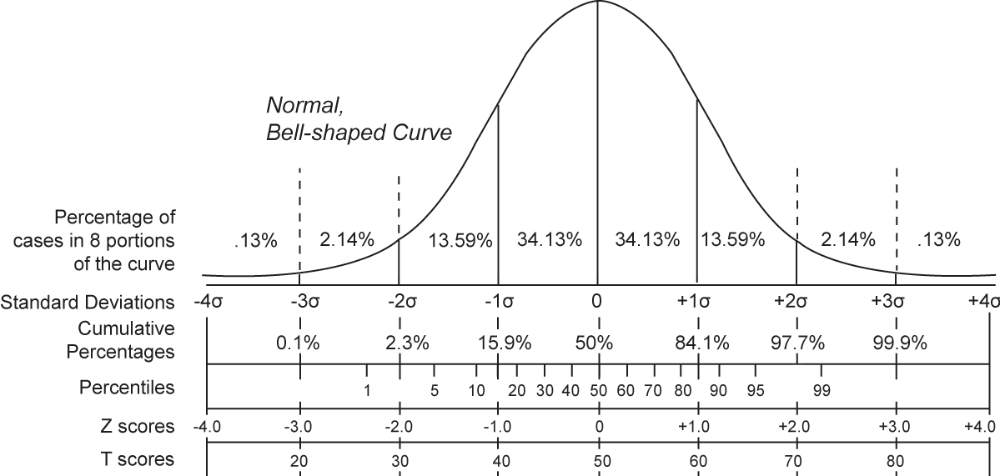

```{r}
#| include: false
#| message: false
#| warning: false

set.seed(15051995)

pkg <- c("ggplot2","patchwork","distributional","ggdist","tidyverse")
sapply(pkg, require, character.only = T)

gen_norm <- function(mu, sd){
  x = rnorm(1e6,mu,sd)
  return(data.frame(x=x))
}

my_cols <- c("deeppink4", "deepskyblue4", "#F8A31B", "forestgreen", "#000000")

theme_clean <- function(base_size = 14) {
  list(
    theme_classic(base_size = base_size),
    theme(
      axis.line  = element_line(colour = "black", linewidth = 1),
      axis.ticks = element_line(colour = "black", linewidth = 1),
      axis.ticks.length = grid::unit(10, "pt"),
      axis.text = element_text(colour = "black"),
      axis.text.y = element_text(angle = 90, vjust = 0.5, hjust = 0.5),
      axis.text.x = element_text(vjust = 0.5, hjust = 0.5),
      legend.title = element_text(size = base_size),
      legend.text  = element_text(size = base_size),
      legend.key.size = grid::unit(1.2, "lines")
    ),
    guides(
      x = guide_axis(cap = "both"),
      y = guide_axis(cap = "both")
    )
  )
}


burnout = read.csv("data/burnout.csv")

```

# Come si valida un test?

-   **I**: Valutazione preliminare
-   **II**: Studio esplorativo
-   **III**: Studio confermativo
-   **IV**: Standardizzazione e taratura

$\rightarrow$ somministrare lo strumento a un campione rappresentativo,
definendo norme e punteggi di riferimento.

## La distribuzione normale

Si presuppone che la caratteristica misurata abbia una **distribuzione
nota** nella popolazione. Di solito si assume una **distribuzione
normale**:

```{r, echo=FALSE, warning=FALSE, message=FALSE, fig.height=2, fig.width=6}
dat = data.frame(x = rnorm(1e7))
dat|>ggplot(aes(x = x))+geom_density(fill = my_cols[4])+
  scale_x_continuous(breaks = seq(-4,4, 1))+theme_clean()
```

La maggior parte degli individui ha quantità *intermedie* della
caratteristica, quindi pochi individui si collocano agli estremi.

------------------------------------------------------------------------

La distribuzione normale è definita da due parametri $\mu$ (la media) e
$\sigma^2$ (varianza):

<br/>

```{r}
#| echo: false
#| fig-width: 10
#| fig-height: 4
#| fig-align: center

dat = data.frame(x = rbind(gen_norm(0,1),gen_norm(0,2),gen_norm(2,1)),
                 parameters = rep(c("Normale(0, 1)",
                                    "Normale(0, 2)",
                                    "Normale(2, 1)"), each = nrow(gen_norm(0,1))))

ggplot(subset(dat,parameters == "Normale(0, 1)"), aes(x=x, fill = parameters))+
  geom_density(alpha = 0.8)+
  scale_fill_manual(values = my_cols)+
  xlab("")+xlim(-8,8)+
  theme_clean(base_size = 24)+
  theme(legend.position = "right",
        legend.title=element_blank())
```

------------------------------------------------------------------------

La distribuzione normale è definita da due parametri $\mu$ (la media) e
$\sigma^2$ (varianza):

<br/>

```{r}
#| echo: false
#| fig-width: 10
#| fig-height: 4
#| fig-align: center
ggplot(subset(dat, parameters != "Normale(2, 1)"), aes(x = x, fill = parameters)) +
  geom_density(alpha = 0.8) +
  scale_fill_manual(values = my_cols) +
  xlab("") + xlim(-8, 8) +
  theme_clean(base_size = 24) +
  theme(legend.position = "right", legend.title = element_blank())
```

------------------------------------------------------------------------

La distribuzione normale è definita da due parametri $\mu$ (la media) e
$\sigma^2$ (varianza):

<br/>

```{r}
#| echo: false
#| fig-width: 10
#| fig-height: 4
#| fig-align: center

ggplot(dat, aes(x=x, fill = parameters))+
  geom_density(alpha = 0.8)+
  scale_fill_manual(values = my_cols)+
  xlab("")+xlim(-8,8)+
  ylim(0,0.4)+
  theme_clean(base_size = 24)+
  theme(legend.position = "right",
        legend.title=element_blank())
```

## Standardizzazione e taratura

1.  Raccogliere i punteggi grezzi sul campione normativo
2.  Stimare i parametri della distribuzione ($\mu$, $\sigma$)
3.  Trasformare i punteggi in scale standardizzate
4.  Produrre le **tavole di conversione** grezzi → standardizzati

**Scale comuni:** percentili, **punti Z**, ...

### Il campione normativo

> Il campione normativo è il gruppo di soggetti le cui risposte al test
> costituiscono il termine di riferimento per valutare qualsiasi
> soggetto sottoposto successivamente al test.

-   **Rappresentatività** — rispecchia la popolazione target
-   **Ampiezza** — migliaia di soggetti per ridurre l'errore di stima
-   **Specificità culturale** — norme locali, non straniere

::: callout-important
Un buon manuale deve descrivere le caratteristiche del campione
normativo.
:::

------------------------------------------------------------------------

```{r, fig.height=4, fig.width=9}
#| echo: false
voti <- c(rep(4,3),rep(5,6), rep(6,8), rep(7,9), rep(8,8), rep(9,6), rep(10,3))
barplot(table(voti), col = "grey",
        ylab="Frequenza", xlab="Voto", main="Distribuzione voti")
```

```{r}
#| echo: true
quantile(voti, probs = c(0.025, .05, .10, 0.25, 0.5, 0.75, 0.9, 0.95, 0.975))
```

### Test ansia (scala Likert 1-5), 5 item

**Dati Tizio:** item1=4, item2=5, item3=4, item4=5, item5=4

Punteggio **grezzo** globale (somma): 22

**95-esimo** percentile indicato nel manuale $20$

**Tizio è ansioso?**

------------------------------------------------------------------------

### Stimare i parametri della distribuzione

**Valori normativi manuale:** $\mu=15$, $\sigma=3$

```{r, fig.height=4, fig.width=9}
#| echo: false
set.seed(123)
n_soggetti <- 10000

punteggi_continui <- rnorm(n_soggetti, mean = 15, sd = 3)

punteggi_grezzi <- round(punteggi_continui)
punteggi_grezzi[punteggi_grezzi < 5] <- 5
punteggi_grezzi[punteggi_grezzi > 25] <- 25

df_ansia <- data.frame(Punteggio_Grezzo = punteggi_grezzi)

hist(df_ansia$Punteggio_Grezzo, 
     breaks = seq(4.5, 25.5, by=1), 
     freq = FALSE,
     main = "",
     xlab = "Punteggio Grezzo Totale", ylab = "Densità",
     col = my_cols[3], border = "white")

# Curva teorica
curve(dnorm(x, mean=15, sd=3), add = TRUE, col = "black", lwd = 3)

# Linee di cut-off e Tizio
abline(v = 22, col = my_cols[1], lwd = 3) 
text(22, 0.08, "Tizio, 22", col=my_cols[1], pos=4)

quantile(df_ansia$Punteggio_Grezzo, probs = c(0.025, .05, .10, 0.25, 0.5, 0.75, 0.9, 0.95, 0.975))
```

------------------------------------------------------------------------

#### Trasformare i punteggi in scale standardizzate

**Punteggio standardizzato** $\approx 2.33$, $\mu=0$, $\sigma=1$

```{r, fig.height=4, fig.width=9}
#| echo: false
set.seed(123)
n_soggetti <- 1e6

punteggi_continui <- rnorm(n_soggetti, mean = 15, sd = 3)
df_ansia <- data.frame(punti_z= (punteggi_continui-15)/3)

hist(df_ansia$punti_z, 
     breaks = seq(-5, 5, by=0.25), 
     freq = FALSE,
     main = "",
     xlab = "Punteggio Z", ylab = "Densità",
     col = my_cols[3], border = "white")

# Curva teorica
curve(dnorm(x, mean=0, sd=1), add = TRUE, col = "black", lwd = 3)

# Linee di cut-off e Tizio
abline(v = 2.33, col = my_cols[1], lwd = 3) 
text(2.33, 0.08, "Tizio, 2.33", col=my_cols[1], pos=4)

round(quantile(df_ansia$punti_z, probs = c(0.025, .05, .10, 0.25, 0.5, 0.75, 0.9, 0.95, 0.975)),2)
```

# Punteggi grezzi e standardizzati

## Definizioni

-   **Punteggi grezzi**: valori raccolti direttamente dal test
-   Non interpretabili direttamente
-   **Standardizzazione**: trasformazione in valori interpretabili e
    confrontabili

## Standardizzazione: formula generale

La trasformazione lineare che riscala $X$ verso una distribuzione target
con media e deviazione standard desiderate:

$$Y = (X - \bar{X})\frac{s_Y}{s_X} + \bar{Y}$$

dove $\bar{Y}$ e $s_Y$ sono la **media e deviazione standard target**
della scala desiderata. Ad esempio:

| Scala      | $\bar{Y}$ | $s_Y$ |
|:-----------|:---------:|:-----:|
| Punteggi T |    50     |  10   |
| QI         |    100    |  15   |
| Punteggi Z |     0     |   1   |

## Caso speciale: il punto Z

Se la distribuzione target ha $\bar{Y} = 0$ e $s_Y = 1$:

$$Z = (X - \bar{X})\frac{1}{s_X} + 0 = \frac{X - \bar{X}}{s_X}$$

Dove:

-   $X$ è il punteggio grezxo,
-   $\bar{X}$ è la media della popolazione
-   $s_{X}$ è la deviazione standard della popolazione

Esprime la distanza di $X$ dalla media in unità di deviazioni standard.

### Punti Z

-   Quante deviazioni standard e in che direzione dista il punteggio
    ottenuto da un soggetto rispetto alla media dei punteggi della
    popolazione?

-   Z = -1.96 significa che il soggetto ha ottenuto un punteggio di 1.96
    deviazioni standard inferiore rispetto al punteggio medio della
    popolazione. Solo il 0.025% della popolazione ha un punteggio così
    basso!

-   Nel caso in cui la distribuzione dei punteggi del test nella
    popolazione sia approssimativamente normale, i punti Z possono
    essere utilizzati per interpretare direttamente le prestazioni dei
    soggetti

------------------------------------------------------------------------

I punteggi standardizzati permettono di confrontare misure su **scale
diverse**, perché la standardizzazione le porta tutte sulla **stessa
unità di misura**!

```{r, fig.height=3.5, fig.width=5}
#| echo: false
x <- seq(-5, 7, 0.1)
plot(x, dnorm(x,0,0.8), type="l", lwd=3, col=my_cols[2],
     ylim=c(0,1.2),
     xlab="Punteggio", ylab="Densità")
lines(x, dnorm(x,0,1.5), lwd=3, col=my_cols[3])
lines(x, dnorm(x,2,1), lwd=3, col=my_cols[1])
legend("topright", c("Matematica","Verbale","Logica"), 
       col=c(my_cols[3],my_cols[1],my_cols[2]), lwd=2)
```

------------------------------------------------------------------------

```{r,fig.height=4, fig.width=6}
#| echo: false
x <- seq(-5, 5, 0.1)
plot(x, dnorm(x,0,1.5), type="l", lwd=4, col=my_cols[3], ylim=c(0,0.4),
     xlab="Punteggio", ylab="Densità")
lines(x, dnorm(x,0,1), lwd=4, col=my_cols[4])
legend("topright", c("grezzo, sd=1.5","Z, sd=1"), 
       col=c(my_cols[3],my_cols[4]), lwd=3)

```

------------------------------------------------------------------------

[{fig-align="left"
width="452"}](https://commons.wikimedia.org/wiki/File:Normal_distribution_and_scales.gif)

## Esempio: PSWQ

Il Penn State Worry Questionnaire (PSWQ) è un test monodimensionale e il
punteggio totale si ottiene sommando i punteggi grezzi di ciascun item
(16, gamma 1-5).

Punteggi elevati del **PSWQ** (corrispondenti a un punto z uguale o
superiore a 2) indicano un tratto di personalità incline a preoccuparsi
con frequenza e intensità eccessive: una tendenza tipica, non
controllabile, generalizzata e non circoscritta a specifici contenuti.

[Fonte](https://d1q0teag7w3vb.cloudfront.net/didalabs/professionisti/Psicologia_clinica/assessment.pdf)

------------------------------------------------------------------------


[Fonte](https://d1q0teag7w3vb.cloudfront.net/didalabs/professionisti/Psicologia_clinica/assessment.pdf)

------------------------------------------------------------------------

[Esempio domande](slides/02-StatBase/img/pswq-test.pdf)

------------------------------------------------------------------------

Proviamo, è completamente anonimo!

{width="200"}

------------------------------------------------------------------------

Vediamo come sono distributi i dati!

Rispetto alla distribuzione su cui è stato tarato il test...

## Meglio media e SD, o percentili?

-   **Distribuzione approssimativamente normale**: media e deviazione
    standard ok!

-   **Distribuzione fortemente asimmetrica**: preferire i percentili,
    indici "robusti" perché meno sensibili alla forma della
    distribuzione.

-   In pratica, i manuali forniscono **entrambi** per garantire una
    valutazione il più completa possibile

# La probabilità

### Area = Proporzione

-   L'area totale sotto la curva è uguale a 1

-   Questo significa che l'area compresa tra due valori $z$ corrisponde
    alla proporzione di soggetti che ottengono un punteggio in
    quell'intervallo.

```{r, echo=FALSE, warning=FALSE, message=FALSE, fig.height=2, fig.width=8}
dat = data.frame(x = rnorm(1e6))
dat|>ggplot(aes(x = x))+geom_density(fill = "steelblue", alpha =.5)+
  scale_x_continuous(breaks = seq(-4,4, 1))+theme_classic()+
  geom_vline(xintercept = c(-1,1), lwd = 1, linetype = "dashed")
```

Esempio: l'area tra $z = −1$ e $z = +1$ è circa $0.68$, il 68% dei
soggetti cade in questo intervallo.

### Proporzione = Probabilità

Se scelgo a caso un soggetto dalla popolazione, che assumo provenga da
una distribuzione normale standard, qual'è la probabilità che il suo
valore cada tra -1 e 1?

$P(−1 \leq Z \leq 1) = 0.68$

------------------------------------------------------------------------

-   Ma cos'è esattamente una probabilità?

-   Possiamo sempre calcolare un'area sotto una curva, ma sotto quale
    curva? E perché?

## Introduzione

-   In termini generali, la **probabilità** può essere vista come il
    grado di **fiducia** rispetto al manifestarsi di un evento

-   In altre parole, la probabilità è una misura matematica che serve ad
    esprimere la nostra **incertezza**

## Definizioni: Spazio campionario, esito e evento

-   Dato un fenomeno casuale (ad esempio, un lancio di un dado),
    l'insieme di tutti i possibili esiti (risultati) è detto **spazio
    campionario** (S)

-   Gli elementi di **S** devono essere tra loro **mutuamente
    esclusivi** e complessivamente **esaustivi**

------------------------------------------------------------------------

L'intersezione tra gli eventi è nulla, quindi se abbiamo due eventi A e
B se la loro intersezione è nulla questi eventi si dicono **mutuamente
esclusivi** o **mutuamente disgiunti**

$$A \cap B = \emptyset$$

Se l'unione tra gli eventi coincide con lo spazio campione, gli eventi
si dicono **collettivamente esaustivi**

$$(A + B) = S$$

**Partizione:** Se gli eventi sono sia mutuamente esclusivi che
collettivamente esaustivi, si può dire che ogni evento costituisce una
**partizione unica dello spazio campione**.

### Evento

Un **evento**(**E**) è un sottoinsieme di S:

-   Fenomeno casuale: Un lancio di un dado a 6 facce
-   Spazio campionario: $S =  \{1, 2, 3, 4, 5, 6 \}$
-   Evento: L'uscita di un numero pari, $E=\{2 ,4 ,6\}$

## Spazi campionari discreti e continui

Uno spazio campionario si dice **discreto** se i suoi elementi sono
numerabili in categorie

-   Fenomeno: Numero di errori in un compito
-   Spazio Campionario: $S =  \{1, 2, 3, 4, 5, 6, \ldots\}$

------------------------------------------------------------------------

Uno spazio campionario si dice **continuo** se i suoi elementi non sono
direttamente numerabili, ma rappresentano un continuo di valori

-   Fenomeno: tempo di risposta ($\theta$)
-   Spazio Campionario: $S = \theta \geq 0$

## La probabilità

La probabilità, $P()$, è una funzione matematica che assegna dei valori
numerici a degli esiti possibili di un fenomeno casuale

-   Un valore di probabilità deve essere non negativo: $P(A) \ge 0$.
-   La probabilità dell’intero spazio campionario è pari a 1:
    $P(\Omega)=1$ (i.e., La somma delle probabilità di tutti gli esiti
    dello spazio campionario deve essere pari a 1).
-   Se due eventi sono **mutuamente esclusivi** (non possono verificarsi
    insieme), allora la probabilità che si verifichi l’uno *oppure*
    l’altro è pari alla somma delle probabilità dei singoli eventi: se
    $A \cap B = \varnothing$, allora $P(A \cup B)=P(A)+P(B)$.

(Assiomi di Kolmogorv, 1956)

# Distribuzioni di probabilità

Una distribuzione di probabilità è l'insieme di tutti gli esiti dello
spazio campionario e delle corrispettive probabilità.

-   **Fenomeno**: $X$ = esito del lancio di una moneta non truccata;
    dove $X$ è una variabile aleatoria (casuale) che può assumere i
    valori $x = 0$ (Croce) e $x = 1$ (Testa).

-   **Spazio campionario**: $S = \{0, 1\}$.

-   **Distribuzione di probabilità**: $$
    \Pr(X = x) = \theta^{x}(1-\theta)^{1-x},
    $$ dove $\theta$, il parametro che definisce la distribuzione di
    probabilità, è pari a $0.5$.

------------------------------------------------------------------------

-   **Proprietà della distribuzione di probabilità**: $$
    \Pr(X = 0) = 0.5 \ge 0;\quad \Pr(X = 1) = 0.5 \ge 0
    $$ $$
    \Pr(X = 0) + \Pr(X = 1) = 1
    $$

# La distribuzione normale

Nel caso della Normale Standard, lo spazio campionario S è l'intera
retta reale $S = (-\infty, +\infty)$.

Un evento è un qualsiasi intervallo $[a, b]$: ad esempio "avere un
punteggio Z tra −2 e 2".

La probabilità di quell'evento è l'area sotto la curva in
quell'intervallo.

Gli eventi "$Z > 0$" e "$Z < 0$" sono mutuamente esclusivi e
collettivamente esaustivi, cioè sono una partizione di S.

# Credits

-   Kaplan, R. M., & Saccuzzo, D. P. (2023, p. 53). Psychological
    Testing: Principles, Applications, and Issues.

-   Altoè, G. (2022). Corso di Testing Psicologico, Scienze psicologiche
    dello sviluppo, della personalità e delle relazioni interpersonali,
    A.A. 2022/23

-   Marci, M. (2025). Corso di Testing Psicologico, Scienze psicologiche
    dello sviluppo, della personalità e delle relazioni interpersonali,
    A.A. 2025/26

-   https://www.di.univr.it/documenti/OccorrenzaIns/matdid/matdid036074.pdf

-   https://fad.unich.it/pluginfile.php/64973/mod_resource/content/1/Stat_Formazione_slides15.pdf
